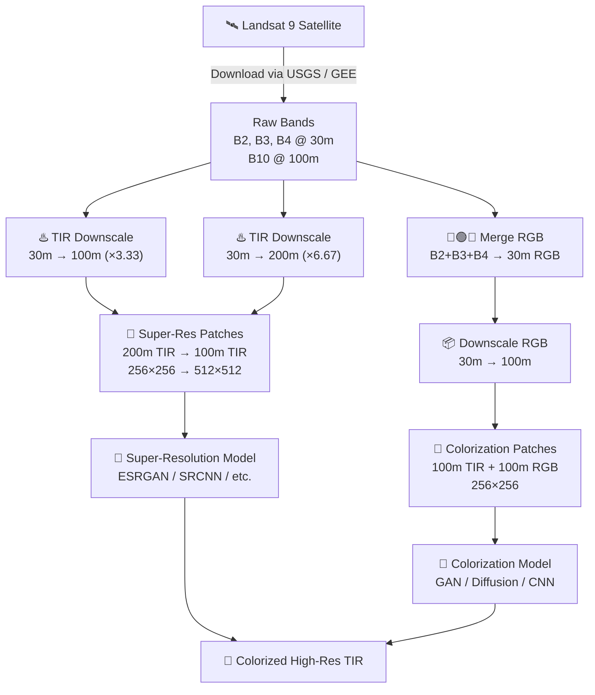
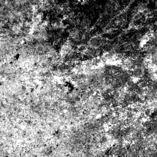
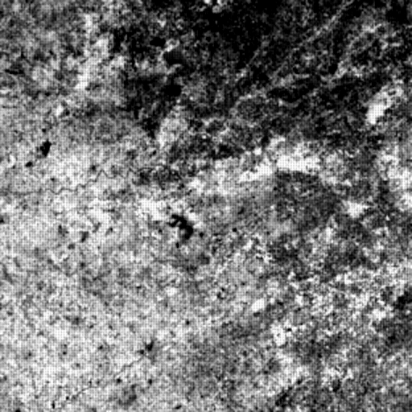
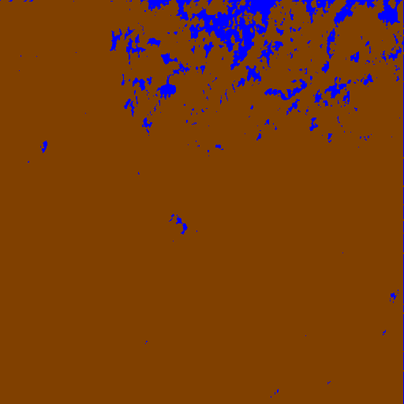

<div align="center">


# 🛰️ IR Image Colorization & Enhancement
### *Bhartiya Antriksh Hackathon (BAH) 2026 — Problem Statement 10*

> **Transforming raw Thermal Infrared satellite imagery into vivid, interpretable RGB representations using Deep Learning.**

[](https://python.org)
[](https://pytorch.org)
[](https://gdal.org)
[](LICENSE)

</div>

---

## 📖 Table of Contents

- [🎯 The Challenge](#-the-challenge)
- [🏗️ Architecture Overview](#️-architecture-overview)
- [📡 Data Acquisition](#-data-acquisition)
- [⚙️ Pipeline Walkthrough](#️-pipeline-walkthrough)
- [🖼️ Sample Results](#️-sample-results)
- [🚀 Quick Start](#-quick-start)
- [📂 Repository Structure](#-repository-structure)
- [📋 Output Format](#-output-format)
- [📝 Submission Guidelines](#-submission-guidelines)

---

## 🎯 The Challenge

Thermal Infrared (TIR) data from Landsat 9 is critical for monitoring:

| 🔥 Wildfires | 🏙️ Urban Heat Islands | 🌋 Volcanic Activity | ❄️ Ice Mapping |
|:---:|:---:|:---:|:---:|
| Real-time detection | Surface temperature mapping | Lava flow tracking | Arctic monitoring |

**The Problem:** Raw TIR imagery is single-band (grayscale) and lacks the intuitive visual detail of RGB imagery, making object interpretation difficult for human analysts.

**Your Goal:** Build a two-stage deep learning pipeline that produces:

```
📥 Input: 200m TIR Band (B10)
         │
         ▼
┌─────────────────────────┐
│  Stage 1: Super-Resolution │  → 200m TIR ──► 100m TIR (4× detail recovery)
└─────────────────────────┘
         │
         ▼
┌─────────────────────────┐
│  Stage 2: Colorization    │  → 100m TIR ──► 100m RGB (synthetic color synthesis)
└─────────────────────────┘
         │
         ▼
📤 Output: High-res Colorized TIR Image
```

---

## 🏗️ Architecture Overview



---

## 📡 Data Acquisition

### Data Specifications

| Band | Description | Native Resolution | Provided As |
|------|-------------|:-----------------:|:-----------:|
| B2   | Blue        | 30m               | 30m         |
| B3   | Green       | 30m               | 30m         |
| B4   | Red         | 30m               | 30m         |
| B10  | TIR (Thermal Infrared) | **100m** | 30m (resampled) |

> ⚠️ **Note:** USGS Earth Explorer provides all bands resampled to **30m**. The true TIR resolution is **100m**. The baseline pipeline accounts for this by downscaling back to the native resolution.

---

### Option 1 — Quick Demo Data

```bash
chmod +x scripts/download_data.sh
./scripts/download_data.sh
# Downloads sample bands into input/demo_product/
```

### Option 2 — Google Earth Engine (Custom)

```bash
python scripts/download.py \
  <product_id> <bands> <start_date> <end_date> <output_path> \
  --ee_project_id <your_project_id>
```

### Option 3 — USGS Earth Explorer (Manual)

Download directly from [USGS Earth Explorer](https://earthexplorer.usgs.gov/) and place files in the `input/` directory.

### Required Input Structure

```
input/
└── <folder_name>/          # e.g., LC09_L2SP_071242_20260612_02_T1
    ├── <prefix>_B10.TIF    # Thermal Infrared
    ├── <prefix>_B2.TIF     # Blue band
    ├── <prefix>_B3.TIF     # Green band
    └── <prefix>_B4.TIF     # Red band
```

> 📌 `<folder_name>` can be any identifier, but files must end with `_B10.TIF`, `_B2.TIF`, `_B3.TIF`, `_B4.TIF`.

---

## ⚙️ Pipeline Walkthrough

### Step 1 — Generate Dataset

```bash
python driver.py
```

The driver script executes the following stages automatically:

| Stage | Operation | Input → Output |
|-------|-----------|----------------|
| **1. Merge** | Combine B2, B3, B4 | → 30m RGB GeoTIFF |
| **2. Downscale RGB** | Reduce resolution | 30m → 100m RGB |
| **3. Downscale TIR** | Two-factor downscale | 30m → 100m & 200m TIR |
| **4. Patch Extraction** | Co-registered crops | SR pair + Colorization pair |
| **5. Save** | `.npy` + `.png` | `output/patches/` |

#### Rescaling Factors

```
RGB  (30m)  ──×3.33──►  100m RGB   (colorization input)
TIR  (30m)  ──×3.33──►  100m TIR   (SR target / colorization source)
TIR  (30m)  ──×6.67──►  200m TIR   (SR input)
```

#### Patch Sizes

| Task | Input Patch | Target Patch |
|------|:-----------:|:------------:|
| Super-Resolution | 256×256 @ 200m | 512×512 @ 100m |
| Colorization | 256×256 @ 100m TIR | 256×256 @ 100m RGB |

> ⚠️ **Critical:** Use `.npy` files for training — **not** `.png`. PNG files are for visual verification only and lose radiometric precision.

### Spatial Alignment Guarantee

```
200m TIR pixel  ≡  2×2 block in 100m TIR/RGB
```
All patches share the same top-left offset, ensuring perfect spatial co-registration across resolutions.

---

## 🖼️ Sample Results

The pipeline produces a visual progression from raw thermal data to colorized output:

| Step | Preview | Description |
|------|:-------:|-------------|
| **1. Raw TIR @ 200m** |  | Low-res single-band thermal input |
| **2. Super-Resolved TIR @ 100m** |  | 4× resolution enhancement |
| **3. Segmentation Mask** |  | Semantic regions for guided colorization |
| **4. Colorized RGB** |  | Final synthetic RGB output |

---

## 🚀 Quick Start

### Prerequisites

```bash
pip install torch torchvision rasterio gdal numpy pillow tqdm
```

### Full Pipeline (3 steps)

```bash
# 1. Download demo data
./scripts/download_data.sh

# 2. Generate training patches
python driver.py

# 3. Train your model
python train.py

# 4. Run inference
python pipeline.py --input input/<product_folder> --output output/model_outputs/
```

### Gradio Demo App

```bash
python app.py
# Opens interactive UI at http://localhost:7860
```

---

## 📂 Repository Structure

```
IR-colorization-BAH2026/
│
├── 📄 driver.py              # Main dataset generation script
├── 📄 pipeline.py            # End-to-end inference pipeline
├── 📄 train.py               # Model training script
├── 📄 dataset.py             # PyTorch Dataset class
├── 📄 models.py              # Model architectures (SR + Colorization)
├── 📄 app.py                 # Gradio demo application
│
├── 📁 scripts/
│   ├── download.py           # GEE data downloader
│   ├── download_data.sh      # Demo data download script
│   ├── download_landsat.py   # USGS Landsat downloader
│   ├── create_patches.py     # Patch extraction utility
│   ├── downscale.py          # Resolution downscaling
│   └── merge_rgb.py          # Band merging utility
│
├── 📁 utils/
│   ├── file_utils.py         # File I/O helpers
│   ├── logging_utils.py      # Logging configuration
│   └── visualization.py     # Visualization helpers
│
├── 📁 input/                 # 🚫 Place your Landsat 9 data here
├── 📁 output/                # Generated patches and model outputs
│   └── model_outputs/
│       ├── tir_superresolved_100m/   # SR model outputs
│       ├── colorized_tir_100m/       # Colorization model outputs
│       └── previews/                 # Visual preview PNGs
│
└── 📄 .gitignore
```

---

## 📋 Output Format

### Mandatory Output Structure

```
output/
└── model_outputs/
    ├── tir_superresolved_100m/
    │   └── <product_id>.tif        # Super-resolved TIR @ 100m
    └── colorized_tir_100m/
        └── <product_id>.tif        # Colorized TIR @ 100m (3-band)
```

> 📌 `<product_id>` must **exactly match** the original input folder/product name.

### Band Ordering for Colorized Output

| Layer | Channel |
|:-----:|:-------:|
| Layer 1 | 🔵 Blue  |
| Layer 2 | 🟢 Green |
| Layer 3 | 🔴 Red   |

---

## 📝 Submission Guidelines

| # | Deliverable | Format | Required |
|---|-------------|--------|:--------:|
| 1 | **Codebase** | GitHub Repository URL | ✅ |
| 2 | **Model Weights** | `.pth` / `.h5` / `.ckpt` | ✅ |
| 3 | **Technical Report** | PDF (approach + results) | ✅ |
| 4 | **Sample Results** | Raw TIR → SR TIR → Colorized TIR | ✅ |

---

<div align="center">

### 🌟 Good Luck to All Participants!

*Built with ❤️ for the Bhartiya Antriksh Hackathon 2026*

[](https://www.isro.gov.in/)
[](https://bhartiyaantrikshhackathon.com/)

</div>
